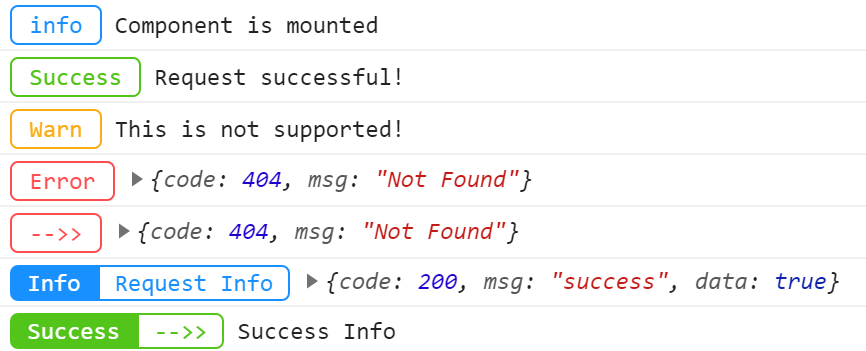

# b-pretty-log

A browser `console.log()` tool, which can make the printed message look better.

## How to install:

Using npm:
```bash
npm install b-pretty-log
```

Using yarn:
```bash
yarn add b-pretty-log
```

Using jsDelivr CDN:
```html
<script src="https://cdn.jsdelivr.net/npm/b-pretty-log/dist/index.js"></script>
```

## Example

Import libraries in entry file:
```javascript
import log from 'b-pretty-log'
```

Print a message:
```javascript
log('info', 'Component is mounted')
```


More ways to use it:

```javascript
const err = { code: 404, msg: 'Not Found' }
log('Success', 'Request successful!', 'success')
log('Warn', 'This is not supported!', 'warning')
log('Error', err, 'danger')

log.error('-->>', err)

// pretty log style
const res = { code: 200, msg: 'success', data: true }
log.pretty('Info', 'Request Info', res)

log.pretty('Success', '-->>', 'Success Info', 'success')
```



## API

### log(text: any, content: any, color?: ColorType, back?: boolean)

- **text: **Content in a wireframe or box
- **content:** The content behind a wireframe or square
- **color:** `<ColorType>` or hex color value, `<ColoType>` has `'success' | 'warning' | 'danger' | 'info' | 'primary'(default)`
- **back:** Is display background, the text will be white

### Alias of the method

- `log.success(text, content)`
- `log.warn(text, content)`
- `log.error(text, content)`
- `log.info(text, content)`

### log.pretty(title: string, text: string, content: any, color?: ColorType)

- **title:** Text on the background
- **text:** Text on the border
- **content:** details
- **color:** `<ColorType>` or hex color value, `<ColoType>` has `'success' | 'warning' | 'danger' | 'info' | 'primary'(default)`

